# Verifier API


## Overview

The **Verifier** is a Node.js + Express backend API for a full-stack Web3 application.  
It receives signed messages from the frontend, verifies the signature using [ethers.js](https://docs.ethers.org/), and returns the verification result.

## Features & Capabilities

- **REST API** for signature verification.
- **Ethers.js** used for cryptographic signature recovery and validation.
- **CORS** enabled for cross-origin requests from frontend apps.
- **Robust error handling** for missing or invalid input.
- **No database required**; stateless and lightweight.


## API Endpoint

### `POST /verify-signature`

**Request Body:**
```json
{
  "message": "string",
  "signature": "string"
}
```

**Response:**
```json
{
  "isValid": true,
  "signer": "0xabc123...",
  "originalMessage": "...",
  "messageHash": "0x..."
}
```

- `isValid`: Boolean indicating if the signature is valid.
- `signer`: The Ethereum address that signed the message.
- `originalMessage`: The original message sent for verification.
- `messageHash`: The hash of the original message.

---

## Working Flow

1. **Frontend** sends a POST request to `/verify-signature` with a message and its signature.
2. **Verifier API**:
    - Checks for required fields.
    - Recovers the signer address from the signature and message.
    - Hashes the message and recovers the address again for validation.
    - Compares both recovered addresses for extra integrity.
    - Returns the result as JSON.
3. **Frontend** displays the verification result to the user.

---

## Flow Chart

```mermaid
flowchart TD
  A["Frontend sends &#123;message, signature&#125;"] --> B[Verifier API receives request]
  B --> C[Check for missing fields]
  C --> D[Recover address from signature]
  D --> E[Hash message and recover address again]
  E --> F[Compare both addresses]
  F --> G["Return JSON result: isValid, signer, originalMessage, messageHash"]
  G --> H[Frontend displays result]

```



---

## Example Usage

**Request:**
```bash
curl -X POST http://localhost:3001/verify-signature \
  -H "Content-Type: application/json" \
  -d '{"message":"Hello, world!","signature":"0x..."}'
```

**Response:**
```json
{
  "isValid": true,
  "signer": "0xabc123...",
  "originalMessage": "Hello, world!",
  "messageHash": "0x..."
}
```

---

## Project Structure

```
verifier/
├── index.js
├── package.json
└── src
    ├── controllers
    │   └── signatureController.js
    └── middleware
        └── errorHandler.js
```

---

## How to Run

1. Install dependencies:
    ```bash
    npm install
    ```
2. Start the server:
    ```bash
    npm start
    ```
    The API will run on [http://localhost:3001](http://localhost:3001).

---

## Summary

The **Verifier** API provides a secure, stateless, and efficient backend for verifying Ethereum signatures.  
It is designed to work seamlessly with the Signer frontend, but can be used with any client that needs signature verification.